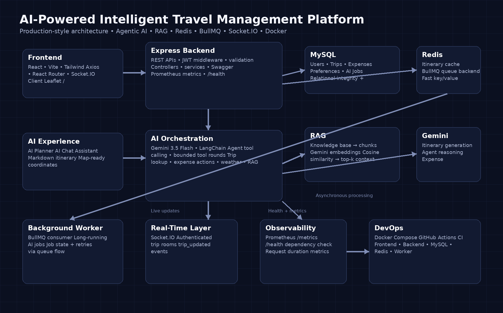

::: {align="center"}
# ✈️ Roamly

### AI-Powered Intelligent Travel & Expense Management Platform

**Plan trips. Track spending. Ask your data. Get grounded AI
recommendations.**

[](https://react.dev/)
[](https://nodejs.org/)
[](https://www.mysql.com/)
[](https://redis.io/)
[](https://www.docker.com/)
[](https://www.langchain.com/)
[](https://ai.google.dev/)
:::

------------------------------------------------------------------------

## 🧭 What is Roamly?

Roamly is a full-stack **AI travel and expense management platform**
designed around one idea:

> **Your travel planner should understand your trip, your spending, and
> your questions---not just generate a static itinerary.**

The platform combines a conventional travel-management backend with
modern AI and infrastructure patterns:

-   🤖 **Agentic AI** with Gemini + LangChain
-   📚 **RAG** for grounded travel-knowledge retrieval
-   ⚡ **Redis caching** to reduce repeated AI calls
-   📨 **BullMQ background processing** for asynchronous jobs
-   🔴 **Socket.IO real-time updates** with trip-scoped rooms
-   📊 **Budget intelligence** using deterministic statistical
    prediction
-   🚨 **Expense anomaly detection**
-   🗺️ **AI-generated map locations** rendered with Leaflet
-   🩺 **Prometheus metrics + health checks**
-   🐳 **Docker Compose multi-service environment**
-   🔄 **GitHub Actions CI**

------------------------------------------------------------------------

## ✨ Why this project is different

This is not just:

``` text
React → Express → MySQL
```

It is a small production-style system where different engineering
patterns solve different problems:

  Problem                             Solution
  ----------------------------------- ---------------------------
  Secure user access                  JWT + bcrypt
  Repeated AI requests                Redis cache
  Long-running operations             BullMQ + Redis Worker
  Application-specific AI knowledge   RAG
  AI actions over application data    LangChain tool calling
  Live trip updates                   Socket.IO rooms
  Spending forecasting                Statistical prediction
  Unusual expense detection           Mean + standard deviation
  API visibility                      Swagger/OpenAPI
  Runtime observability               Prometheus
  Reproducible local environment      Docker Compose
  Automated validation                GitHub Actions

------------------------------------------------------------------------

## 🏗️ Architecture



### High-level request flow

``` text
User
  ↓
React Frontend
  ↓
Express API
  ├── MySQL
  ├── Redis
  ├── AI Agent → Gemini
  │          └→ RAG Knowledge Base
  ├── Socket.IO
  └── BullMQ → Redis → Worker
```

------------------------------------------------------------------------

# 🧠 AI Architecture

## 1. Agentic AI Assistant

The assistant is more than a normal chatbot.

It can decide when it needs to use an application tool before producing
an answer.

### Available capabilities

-   Retrieve the user's trips
-   Retrieve trip details
-   Add expenses
-   Retrieve travel knowledge through RAG
-   Fetch live weather information
-   Maintain a bounded recent conversation history

### Tool-calling flow

``` text
User Question
     ↓
Gemini / LangChain Agent
     ↓
Does the model need a tool?
     ├── No → Final answer
     │
     └── Yes
          ↓
      Tool Call
          ↓
    Application / API
          ↓
      Tool Result
          ↓
       Gemini
          ↓
     Final Answer
```

This makes the assistant capable of **retrieving information and
performing application actions**, instead of only generating text.

------------------------------------------------------------------------

# 📚 2. RAG --- Retrieval-Augmented Generation

Roamly uses RAG when the assistant needs information from the
application's travel knowledge base.

### Indexing

``` text
Knowledge Base
      ↓
Document Chunking
      ↓
Gemini Embeddings
      ↓
Vector Representations
      ↓
Stored Vector Data
```

### Retrieval

``` text
User Question
      ↓
Query Embedding
      ↓
Cosine Similarity
      ↓
Top Relevant Chunks
      ↓
Context
      ↓
Gemini
      ↓
Grounded Response
```

### Why RAG?

Instead of expecting the LLM to know every application-specific travel
rule or policy, relevant information is retrieved and supplied as
context.

This provides:

-   More grounded responses
-   Less hallucination risk
-   Easier knowledge-base updates
-   No model retraining for every document change

------------------------------------------------------------------------

# ⚡ 3. Redis Caching

AI generation can be expensive and slow when the same request is
repeated.

Roamly caches generated itineraries.

``` text
AI Request
    ↓
Redis GET
    │
    ├── Cache HIT ─────→ Return cached itinerary
    │
    └── Cache MISS
             ↓
           Gemini
             ↓
          Redis SET
             ↓
        Return result
```

Generated itinerary cache entries are stored with a **24-hour TTL**.

Redis also acts as the infrastructure layer for BullMQ.

So Redis has two roles:

``` text
Redis
 ├── Fast application cache
 └── BullMQ queue backend
```

------------------------------------------------------------------------

# 📨 4. Background Job Processing

Long-running operations can be moved away from the request-response path
using BullMQ.

``` text
API / Producer
      ↓
   BullMQ
      ↓
    Redis
      ↓
 Background Worker
      ↓
 AI / Database Work
      ↓
 Job Status / Result
```

This architecture allows the API and background processing to scale
independently.

> **Note:** The current synchronous AI planner endpoint can generate an
> itinerary directly, while the repository also contains the BullMQ
> worker architecture for asynchronous AI jobs.

------------------------------------------------------------------------

# 🔴 5. Real-Time Trip Updates

Roamly uses Socket.IO to keep users viewing a trip synchronized.

Each trip gets its own Socket.IO room.

``` text
Trip #101
 ├── User A
 ├── User B
 └── User C

        ↓

Socket Room: "101"
```

When an expense changes:

``` text
Expense Update
     ↓
Database Update
     ↓
Socket.IO Event
     ↓
trip_updated
     ↓
Only clients in that trip room refresh
```

This prevents unrelated users/trips from receiving unnecessary updates.

------------------------------------------------------------------------

# 💰 Budget Intelligence

Roamly does not pretend that a simple formula is a sophisticated trained
ML model.

The current budget intelligence layer uses **deterministic statistical
methods**.

## Spending projection

``` text
Total Spent
    ↓
Active Spending Days
    ↓
Average Daily Spend
    ↓
Remaining Days
    ↓
Projected Final Spend
```

Conceptually:

``` text
Average Daily Spend = Total Spent / Active Days

Projected Spend =
Current Spend + Average Daily Spend × Remaining Days
```

## Anomaly detection

Expense values are evaluated using mean and standard deviation.

``` text
Expenses
   ↓
Mean + Standard Deviation
   ↓
Upper Threshold
   ↓
Unusually large expense?
   ├── No → Normal
   └── Yes → Anomaly
```

This keeps the feature explainable and deterministic.

------------------------------------------------------------------------

# 🔐 Security

Security is handled at multiple layers:

-   **bcrypt** password hashing
-   **JWT** authentication
-   Protected API routes
-   User/trip ownership checks
-   Input validation
-   Request-size limits
-   Helmet security headers
-   Environment-based secrets
-   Trip-scoped Socket.IO rooms

### Authentication flow

``` text
Login
  ↓
Validate credentials
  ↓
Fetch user
  ↓
bcrypt.compare()
  ↓
JWT signed with secret
  ↓
Client stores token
  ↓
Protected request
  ↓
JWT verification middleware
  ↓
req.user
  ↓
Authorized controller
```

------------------------------------------------------------------------

# 🗄️ Data Model

The core relational model is centered around users, trips and expenses.

``` text
User
 ├── Trips
 │    └── Expenses
 │
 ├── Preferences
 │
 └── AI Jobs
```

This relational design allows trip ownership, expense aggregation and
user-specific AI operations to remain consistent.

------------------------------------------------------------------------

# 🐳 Docker Architecture

The application can be started as a multi-container stack:

``` text
┌─────────────────────────────────────┐
│           Docker Compose            │
│                                     │
│  Frontend                           │
│      │                              │
│      ▼                              │
│  Backend ───────► MySQL             │
│      │                              │
│      ├───────────► Redis             │
│      │               │              │
│      │               ▼              │
│      └──────────► Worker             │
│                                     │
└─────────────────────────────────────┘
```

### Services

  Service      Purpose
  ------------ -------------------------------------
  `frontend`   React/Vite application
  `backend`    Express REST API + AI orchestration
  `mysql`      Persistent relational data
  `redis`      Cache + BullMQ backend
  `worker`     Background job processing

------------------------------------------------------------------------

# 📈 Observability

Two important endpoints are exposed:

### Health

``` text
GET /health
```

Used to verify application and database health.

### Metrics

``` text
GET /metrics
```

Exposes Prometheus-compatible metrics such as HTTP request duration and
request information.

This creates a foundation for monitoring the application in a production
environment.

------------------------------------------------------------------------

# 🔄 CI

GitHub Actions is used to validate changes automatically.

The CI workflow covers:

-   Dependency installation
-   Frontend build/lint validation
-   Docker Compose configuration validation
-   Pull-request / main-branch checks

This helps catch integration and build problems before deployment.

------------------------------------------------------------------------

# 🧰 Technology Stack

### Frontend

-   React
-   Vite
-   Tailwind CSS
-   Axios
-   React Router
-   Socket.IO Client
-   React Leaflet
-   Recharts

### Backend

-   Node.js
-   Express
-   MySQL
-   JWT
-   bcrypt
-   Socket.IO
-   Redis
-   BullMQ

### AI

-   Google Gemini
-   LangChain
-   Tool Calling
-   RAG
-   Gemini Embeddings
-   Statistical budget intelligence

### DevOps / Observability

-   Docker
-   Docker Compose
-   GitHub Actions
-   Prometheus
-   Swagger / OpenAPI

------------------------------------------------------------------------

# 📁 Project Structure

``` text
trip-plannerv2/
│
├── frontend/
│   ├── src/
│   │   ├── components/
│   │   ├── pages/
│   │   ├── api/
│   │   └── ...
│   ├── Dockerfile
│   └── package.json
│
├── backend/
│   ├── controllers/
│   ├── routes/
│   ├── services/
│   ├── middleware/
│   ├── config/
│   ├── worker.js
│   ├── server.js
│   └── package.json
│
├── tripplanner.sql
├── docker-compose.yml
├── .github/
│   └── workflows/
│
└── docs/
    └── architecture.png
```

------------------------------------------------------------------------

# 🚀 Run Locally

## Prerequisites

Make sure you have:

-   Docker
-   Docker Compose
-   Git

For AI functionality, you also need a Gemini API key.

------------------------------------------------------------------------

## 1. Clone

``` bash
git clone https://github.com/Vikramshivraj/trip-plannerv2.git
cd trip-plannerv2
```

## 2. Configure environment

Create the backend environment file using the repository's
`.env.example`.

At minimum, configure:

``` env
GEMINI_API_KEY=your_gemini_api_key
JWT_SECRET=your_strong_jwt_secret
```

Keep secrets out of Git.

## 3. Start the complete stack

``` bash
docker compose up --build
```

### Available services

  Service              URL
  -------------------- --------------------------------
  Frontend             http://localhost:5173
  Backend API          http://localhost:5000
  Swagger              http://localhost:5000/api-docs
  Prometheus metrics   http://localhost:5000/metrics
  Health               http://localhost:5000/health

MySQL and Redis are available to the application through the Docker
Compose network.

------------------------------------------------------------------------

# 🧪 Testing

Backend tests:

``` bash
cd backend
npm test
```

Frontend:

``` bash
cd frontend
npm install
npm run dev
```

Backend without Docker:

``` bash
cd backend
npm install
npm run dev
```

------------------------------------------------------------------------

# 🔌 API Overview

The backend exposes REST endpoints for:

-   Authentication
-   User preferences
-   Trips
-   Expenses
-   Trip analytics
-   AI itinerary generation
-   AI assistant chat
-   Health checks
-   Prometheus metrics

Interactive API documentation:

``` text
http://localhost:5000/api-docs
```

------------------------------------------------------------------------

# 🧠 Engineering Decisions

### Why MySQL?

The application has strongly relational entities such as users → trips →
expenses. MySQL provides transactions, foreign keys and reliable
relational queries.

### Why Redis?

Redis provides low-latency caching and also acts as the backend for
BullMQ.

### Why BullMQ?

AI and other long-running operations can be processed asynchronously
without keeping the HTTP request open.

### Why RAG?

RAG allows the assistant to retrieve application-specific knowledge
dynamically without retraining the LLM.

### Why Agentic AI?

The assistant can use tools to retrieve data and perform actions instead
of being limited to text generation.

### Why Socket.IO?

It provides event-driven real-time updates without repeatedly polling
the server.

### Why Docker Compose?

The application consists of multiple dependent services. Compose
provides one reproducible environment for running the complete stack.

------------------------------------------------------------------------

# 🎯 Interview Highlights

If you are presenting this project in an interview, focus on these
engineering stories:

``` text
1. Authentication
   JWT + bcrypt + authorization

2. AI Architecture
   Gemini + LangChain + Tool Calling

3. RAG
   Chunking → Embeddings → Similarity Search → Context

4. Performance
   Redis caching + 24h itinerary TTL

5. Async Architecture
   BullMQ + Redis + Worker

6. Real-Time Systems
   Socket.IO trip rooms

7. Data Consistency
   MySQL transactions + ownership checks

8. Intelligence
   Spending projection + anomaly detection

9. Observability
   Prometheus + health checks

10. DevOps
    Docker Compose + GitHub Actions
```

------------------------------------------------------------------------

# 📌 What I learned building this

This project was built to go beyond CRUD and explore how modern
applications combine:

**Full-Stack Development + AI Engineering + Backend Architecture +
Distributed Processing + Real-Time Systems + DevOps + Observability**

The goal was not only to make the application work, but to understand
**why each architectural component exists and what problem it solves.**

------------------------------------------------------------------------

::: {align="center"}
### ✈️ Plan smarter. Spend better. Travel further.

Built with React, Node.js, MySQL, Redis, LangChain, Gemini and Docker.
:::
